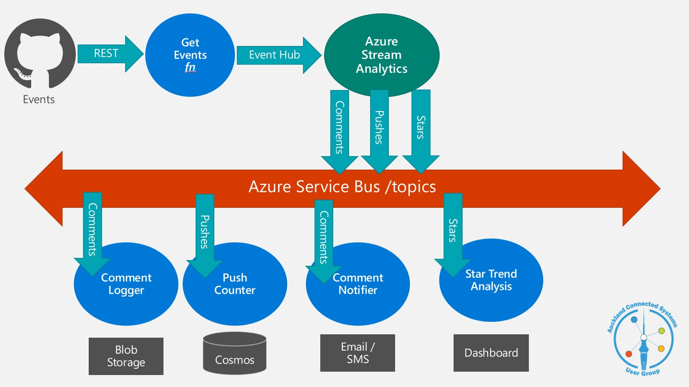

# GitHub Stream Analytics

Solution demo of an event-driven architecture, originally created for Global Integration Bootcamp 2020.

## Getting started

You will need:

1. Azure Subscription
1. PowerShell
1. az CLI
1. A GitHub App ClientId and Client Secret. This is optional, but required for polling the GitHub API
   at a rate of more than 60 times per hour.

> **Note:** This script will deploy resources into your Azure Subscription that may cost you money:

Run this script to deploy the entire environment. When this script completes the pipeline will be running.

    ./deploy.ps1

## Development

You will need a local settings file with connections strings and secrets: `./GithubStream/local.settings.json`.
See `./GithubStream/local.settings.example.json` for an example.

## Links

<https://developer.github.com/v3/>

<https://docs.microsoft.com/en-us/azure/stream-analytics/stream-analytics-solution-patterns>

<https://docs.microsoft.com/en-us/stream-analytics-query/event-delivery-guarantees-azure-stream-analytics>

<https://docs.microsoft.com/en-us/azure/stream-analytics/stream-analytics-documentdb-output>

<https://docs.microsoft.com/en-us/azure/stream-analytics/stream-analytics-add-inputs>

<https://docs.microsoft.com/en-us/azure/stream-analytics/stream-analytics-window-functions>